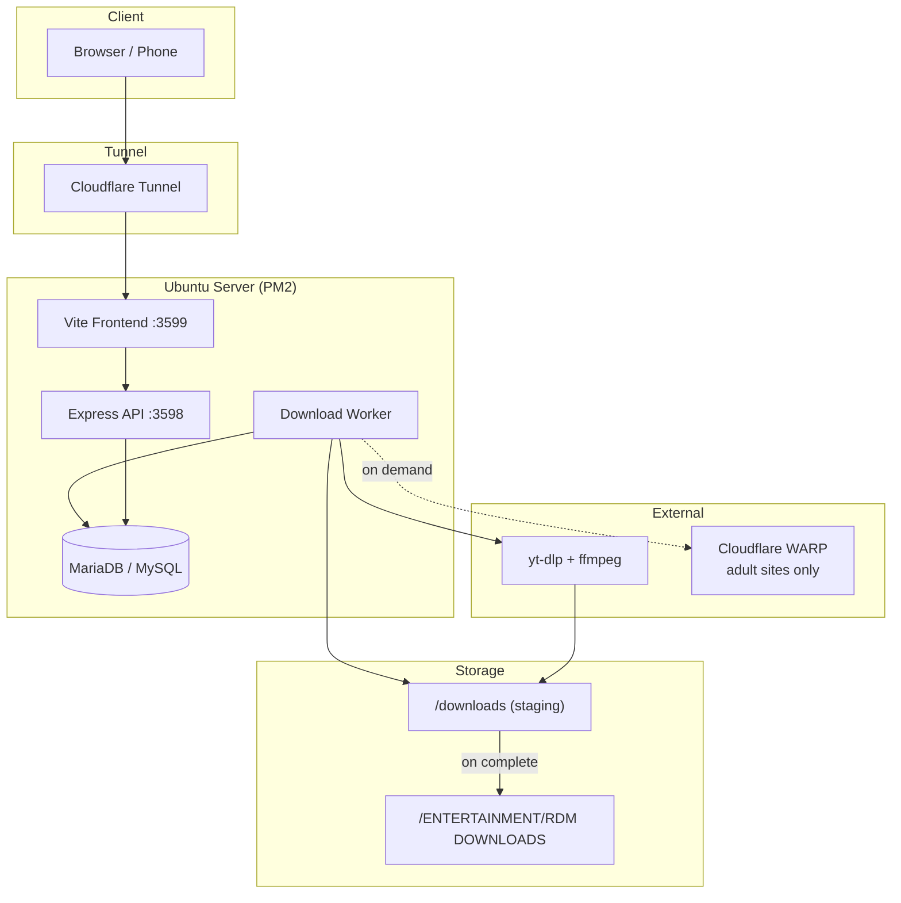

<div align="center">

# RDM — Remote Download Manager

**Your personal home-server download hub.** Queue links from any device — files save on your server, downloads keep running when you close the tab.

[](https://nodejs.org/)
[](https://react.dev/)
[](https://github.com/yt-dlp/yt-dlp)
[](https://github.com/TechVatika)

[Features](#-features) ·
[Architecture](#-architecture) ·
[Quick Start](#-quick-start) ·
[Configuration](#%EF%B8%8F-configuration) ·
[Deployment](#-deployment) ·
[Scripts](#-scripts)

</div>

---

## Overview

**RDM** is a self-hosted remote download manager built for power users who want IDM-style speed on a home server. Paste a URL from your phone or laptop, pick a category, and walk away — the worker runs independently of your browser session.

| Engine | Use case |
|--------|----------|
| **yt-dlp** | YouTube, Instagram, TikTok, 1800+ media sites |
| **Segmented HTTP** | Direct `.mkv`, `.zip`, CDN links — up to 32 parallel chunks |
| **AI rename** | Gemini / OpenAI suggests clean filenames after download |
| **Cloudflare WARP** | On-demand proxy for age-gated adult sites only |

> **Live demo domain:** configurable per server via `APP_DOMAIN` (e.g. `rdm.techvatika2026.space` behind Cloudflare Tunnel).

---

## Features

### Downloads

- **Dual engines** — auto-detects whether a URL needs yt-dlp or direct HTTP
- **IDM-style segmented downloads** — 16–32 parallel connections per file
- **Concurrent queue** — multiple jobs with live progress, pause, resume, cancel
- **Bulk queue** — paste up to 50 URLs at once
- **Format picker** — probe media and choose quality before downloading
- **Resume support** — partial HTTP jobs survive worker restarts
- **Auth retry** — username/password prompt for login-protected links

### Platforms

- **1800+ sites** via yt-dlp extractors (YouTube, Vimeo, SoundCloud, Archive.org, …)
- **Browser impersonation** — automatic Chrome TLS fingerprint retry when sites block datacenter IPs
- **Platform Auth UI** — Instagram / Facebook cookies, session tokens, custom proxies
- **Supported Sites browser** — searchable catalog inside the app

### Privacy & 18+ mode

- **Private downloads** — adult URLs are flagged automatically
- **No history** — completed 18+ jobs are purged from the database immediately
- **No AI naming** — adult URLs never sent to Gemini/OpenAI
- **Exclusive queue** — only one 18+ download at a time
- **WARP on-demand** — Cloudflare WARP connects only during adult downloads, then disconnects
- **Filename only in UI** — cards show the file name, not the URL (copy via button)

### Operations

- **Separate worker process** — closing the browser does not stop downloads
- **Staging → final paths** — temp download folder, then move to permanent library on completion
- **SQL activity logs** — worker + API events in `app_logs` table, viewable in the UI
- **System health dashboard** — disk, memory, yt-dlp version, worker heartbeat
- **JWT authentication** — bcrypt passwords, rate-limited login
- **Portable domains** — one `APP_DOMAIN` env var + `setup-domain.sh` for any server

---

## Architecture



### Process model

| PM2 process | Role |
|-------------|------|
| `rdm-backend` | REST API, auth, settings, log viewer |
| `rdm-worker` | Polls queue, runs yt-dlp & segmented HTTP |
| `rdm-frontend` | React dashboard (Vite dev server or static build) |

The worker writes a heartbeat file so the API can report whether downloads are actually running.

---

## Quick Start

### Requirements

| Dependency | Notes |
|------------|-------|
| **Node.js 20+** | Backend + frontend |
| **MariaDB / MySQL** | Job queue & logs |
| **yt-dlp** | `pip install yt-dlp` or standalone binary |
| **ffmpeg** | Media merge / audio extract |
| **PM2** | `npm i -g pm2` for production |
| **cloudflared** | Optional — public HTTPS access |

### 1. Clone

```bash
git clone git@github.com:TechVatika/RDM---Remote-Download-Manager.git
cd RDM---Remote-Download-Manager
```

### 2. Database

```bash
# Edit credentials if needed, then:
bash db/setup.sh
```

### 3. Environment

```bash
cp backend/.env.example backend/.env
nano backend/.env   # set DB password, JWT_SECRET, paths, optional AI keys
```

### 4. Install dependencies

```bash
npm install --prefix backend
npm install --prefix frontend
```

### 5. Start with PM2

```bash
# Update paths in ecosystem.config.cjs if your install dir differs
pm2 start ecosystem.config.cjs
pm2 save
```

Open **http://localhost:3599** — default login is set in `backend/.env` (`AUTH_USERNAME` / `AUTH_PASSWORD`).

---

## Configuration

Key variables in `backend/.env`:

```env
# Server
PORT=3598
APP_DOMAIN=rdm.example.com
FRONTEND_PORT=3599
CF_TUNNEL=my-tunnel

# Database
DB_HOST=127.0.0.1
DB_NAME=rdm

# Paths — staging then final library
DOWNLOAD_BASE_PATH=/mnt/4tb-1/RDM/downloads
DOWNLOAD_FINAL_PATH=/mnt/4tb/ENTERTAINMENT/RDM DOWNLOADS

# Performance
MAX_CONCURRENT_DOWNLOADS=4
DOWNLOAD_CONNECTIONS=16
DOWNLOAD_MAX_CONNECTIONS=32

# Adult sites — WARP proxy (install script provided)
ADULT_SITES_USE_WARP=true
WARP_PROXY_PORT=40000

# Auth
JWT_SECRET=long-random-string-here

# AI rename (optional)
AI_RENAME=true
GEMINI_API_KEY=
```

See `backend/.env.example` for the full list.

---

## Deployment

### Cloudflare Tunnel (public HTTPS)

Point a subdomain at your frontend in one step:

```bash
sudo bash scripts/setup-domain.sh rdm.yourdomain.com your-tunnel-name 3599
```

This updates `backend/.env`, adds a tunnel ingress rule, routes DNS, and restarts PM2.

### Cloudflare WARP (adult sites)

WARP runs in **proxy mode only** — it never tunnels all server traffic:

```bash
sudo bash scripts/install-cloudflare-warp.sh
```

RDM connects WARP automatically when an 18+ download starts and disconnects when it finishes, fails, or is paused.

### Production build (optional)

```bash
cd frontend && npm run build
# Serve frontend/dist/ behind nginx or keep Vite via PM2
```

---

## Scripts

| Script | Purpose |
|--------|---------|
| `db/setup.sh` | Create database, user, and schema |
| `scripts/setup-domain.sh` | Cloudflare Tunnel + DNS + env for a new domain |
| `scripts/install-cloudflare-warp.sh` | Install & configure WARP SOCKS proxy |
| `scripts/check-sites.mjs` | Test yt-dlp extractor compatibility |

```bash
# Check if a specific URL works with your yt-dlp setup
node scripts/check-sites.mjs "https://www.youtube.com/watch?v=..."
```

---

## Project Structure

```
RDM/
├── backend/                 # Express API + download worker
│   ├── src/
│   │   ├── routes/          # REST endpoints
│   │   ├── worker/          # Queue poller, yt-dlp, segmented HTTP
│   │   ├── config/          # WARP, cookies, paths, speed
│   │   └── utils/           # Logger, AI rename, SSRF guard
│   └── .env.example
├── frontend/                # React + Vite dashboard
│   └── src/
│       ├── pages/           # Dashboard shell
│       ├── views/           # Overview, queue, history, logs, …
│       └── components/
├── db/                      # Schema + migrations
├── scripts/                 # WARP, domain, site checker
├── ecosystem.config.cjs     # PM2 process definitions
└── downloads/               # Staging (gitignored)
```

---

## Security Notes

- **Never commit** `backend/.env` — it contains DB credentials, JWT secret, and API keys
- Change `JWT_SECRET` and default `AUTH_PASSWORD` before exposing the app publicly
- Set `CORS_ORIGINS` or rely on `APP_DOMAIN` for cross-origin lockdown
- SSRF protection blocks loopback and metadata IPs by default
- Adult download URLs are excluded from logs, history, stats, and AI providers

---

## API Overview

All endpoints except `/api/health` and `/api/auth/login` require a Bearer JWT.

| Endpoint | Description |
|----------|-------------|
| `POST /api/downloads` | Queue a download |
| `POST /api/downloads/probe` | Inspect media formats |
| `GET /api/downloads` | List jobs |
| `GET /api/system` | Health, disk, engines |
| `GET /api/system/logs` | Activity log viewer data |
| `GET /api/platforms` | Supported site catalog |

---

## Troubleshooting

<details>
<summary><strong>Download fails with 403 / Cloudflare on a media site</strong></summary>

Install browser impersonation support for yt-dlp:

```bash
python3 -m pip install --user "curl_cffi>=0.14,<0.15"
```

RDM retries blocked requests automatically with Chrome impersonation.
</details>

<details>
<summary><strong>Adult site returns 410 / geo-blocked</strong></summary>

Free Cloudflare WARP exits near your server region and may be blocked. Use **Platform Auth → Adult sites → Custom proxy** pointing to a SOCKS proxy in an allowed country.
</details>

<details>
<summary><strong>Worker not picking up jobs</strong></summary>

```bash
pm2 logs rdm-worker
pm2 restart rdm-worker
```

Check **System → Activity Logs** in the UI for queue and WARP events.
</details>

---

## Tech Stack

| Layer | Technology |
|-------|------------|
| Frontend | React 19, Vite 6, SweetAlert2 |
| Backend | Express 5, Node.js ESM |
| Database | MariaDB / MySQL |
| Downloads | yt-dlp, ffmpeg, custom segmented HTTP |
| Process manager | PM2 |
| Tunnel | cloudflared |
| Proxy | Cloudflare WARP (conditional) |

---

<div align="center">

**Built by [TechVatika](https://github.com/TechVatika)**

*Self-hosted. No subscriptions. Your files, your server.*

</div>
